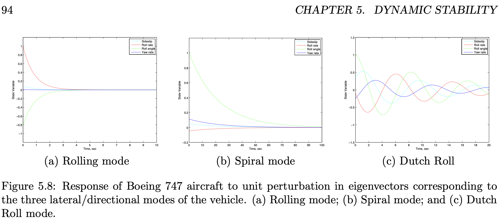

# aircraft_control_sim

 The project is developed for the purpose of acquainting myself with basic aircraft control knowledge.
 
 ## Functionalities
 
 The project consists of the following parts:
 1. An arithmetic expression parser that converts mathematical expressions into tree structures and stores them in a variables lookup table;
 2. The representation of a state model with RK4 integration method that calculates the dynamics of a given state model;
 3. An implementation of algebraic Riccati equation solver that optimizes the stability of a linear state model.

## Demonstration

The Jupyter Notebook file `plot.ipynb` inside the python folder showcases the following lateral/directional-mode state evolutions implemented with the program:
1. Rolling mode stability;
2. Spiral mode stability;
3. Dutch roll stability;
4. Trimming of the aircraft undergoing a unit perturbation in sideslip, with different penalty parameters for the control vector.

The configuration and dimensionless aerodynamic coefficients data are of Boeing 747, obtained from the aircraft handling qualities data reported by NASA (can be found inside the data folder). The configuration used is power approach configuration.

The following compare the results calculated by the program versus the results used by Professor Caughey in his lectures notes on aircraft control:

###
     

